## 文档语法

### 引用提示

#### 常规

> 引用

```
> 引用
```

#### 绿色

?> 帮助提示
```
?> 帮助提示
```
#### 红色

!> 警告提示
```
!> 警告提示
```


## 文字内容

### 删除线

~~删除线~~
```
~~删除线~~
```
### 文字加框

<!-- tabs:start -->

<!-- tab:基本使用 -->

使用 <kbd>Ctrl</kbd>+<kbd>Alt</kbd>+<kbd>Del</kbd> 重启电脑
代码
```
使用 <kbd>Ctrl</kbd>+<kbd>Alt</kbd>+<kbd>Del</kbd> 重启电脑
```
<!-- tab:高级玩法 -->
<kbd>&uarr;</kbd> Arrow Up

<kbd>&darr;</kbd> Arrow Down

<kbd>&larr;</kbd> Arrow Left

<kbd>&rarr;</kbd> Arrow Right

<kbd>&#8682;</kbd> Caps Lock

<kbd>&#8984;</kbd> Command

<kbd>&#8963;</kbd> Control

<kbd>&#9003;</kbd> Delete

<kbd>&#8998;</kbd> Delete (Forward)

<kbd>&#8600;</kbd> End

<kbd>&#8996;</kbd> Enter

<kbd>&#9099;</kbd> Escape

<kbd>&#8598;</kbd> Home

<kbd>&#8670;</kbd> Page Up

<kbd>&#8671;</kbd> Page Down

<kbd>&#8997;</kbd> Option, Alt

<kbd>&#8629;</kbd> Return

<kbd>&#8679;</kbd> Shift

<kbd>&#9251;</kbd> Space

<kbd>&#8677;</kbd> Tab

<kbd>&#8676;</kbd> Tab + Shift

<!-- tab:高级代码 -->
```
<kbd>&uarr;</kbd> Arrow Up

<kbd>&darr;</kbd> Arrow Down

<kbd>&larr;</kbd> Arrow Left

<kbd>&rarr;</kbd> Arrow Right

<kbd>&#8682;</kbd> Caps Lock

<kbd>&#8984;</kbd> Command

<kbd>&#8963;</kbd> Control

<kbd>&#9003;</kbd> Delete

<kbd>&#8998;</kbd> Delete (Forward)

<kbd>&#8600;</kbd> End

<kbd>&#8996;</kbd> Enter

<kbd>&#9099;</kbd> Escape

<kbd>&#8598;</kbd> Home

<kbd>&#8670;</kbd> Page Up

<kbd>&#8671;</kbd> Page Down

<kbd>&#8997;</kbd> Option, Alt

<kbd>&#8629;</kbd> Return

<kbd>&#8679;</kbd> Shift

<kbd>&#9251;</kbd> Space

<kbd>&#8677;</kbd> Tab

<kbd>&#8676;</kbd> Tab + Shift
```

<!-- tabs:end -->


### 隐藏文本
<details>
<summary>点击查看详细内容</summary>
展开的内容
</details>

```
<details>
<summary>点击查看详细内容</summary>
展开的内容
</details>
```

### 文字居中
<center>这一行需要居中</center>

```
<center>这一行需要居中</center>
```

### 文字靠左
<p align="right">这一行需要靠右</p>

```
<p align="right">这一行需要靠右</p>
```

### 文字浮动
定价体系 <sup>Pro<sup>

```
定价体系 <sup>Pro<sup>
```

## 表格

| 左对齐 | 右对齐 | 居中对齐 |
| :-----| ----: | :----: |
| 单元格 | 单元格 | 单元格 |
| b | c | a |

```
| 左对齐 | 右对齐 | 居中对齐 |
| :-----| ----: | :----: |
| 单元格 | 单元格 | 单元格 |
| b | c | a |
```


## 选项卡文档

### 常规模式
不推荐，因为搜索的时候，搜索到单无法定位。

<!-- tabs:start -->

#### **English**

Hello!

#### **French**

Bonjour!

#### **Italian<span class="tab-badge">New!</span>**

Ciao!

<!-- tabs:end -->
```
<!-- tabs:start -->

#### **English**

Hello!

#### **French**

Bonjour!

#### **Italian<span class="tab-badge">New!</span>**

Ciao!

<!-- tabs:end -->
```

### 注释模式

推荐使用

<!-- tabs:start -->

<!-- tab:English -->

Hello!

<!-- tab:French -->

Bonjour!

<!-- tab:Italian<span class="tab-badge">New!</span> -->

Ciao!

<!-- tabs:end -->
```
<!-- tabs:start -->

<!-- tab:English -->

Hello!

<!-- tab:French -->

Bonjour!

<!-- tab:Italian<span class="tab-badge">New!</span> -->

Ciao!

<!-- tabs:end -->
```

## 嵌入内容

当前，嵌入的类型是通过文件后缀自动识别的，这是目前支持的类型：

- **iframe** `.html`, `.htm`

- **markdown** `.markdown`, `.md`

- **audio** `.mp3`

- **video** `.mp4`, `.ogg`

- **code** other file extension

  更多参考：官方[嵌入的类型](https://docsify.js.org/#/zh-cn/embed-files?id=嵌入的类型)
  

嵌入视频示例

<!-- tabs:start -->

<!-- tab:Fileceiver工作模式 -->

[Fileceiver工作模式](http://120.78.202.122:8801/videos/Fileceiver%E5%B7%A5%E4%BD%9C%E6%A8%A1%E5%BC%8F.mp4 ':include :type=video  controls width=710px height=400px')

<!-- tab:嵌入代码 -->

```
[Fileceiver工作模式](http://120.78.202.122:8801/videos/Fileceiver%E5%B7%A5%E4%BD%9C%E6%A8%A1%E5%BC%8F.mp4 ':include :type=video  controls width=710px height=400px')
```

<!-- tabs:end -->

## 流程图

### 节点形状

<!-- tabs:start -->

<!-- tab:文档中使用表 -->
| 形状           | 功能说明                                                     | 形状图示                                                     | 代码                                             |
| -------------- | ------------------------------------------------------------ | ------------------------------------------------------------ | ------------------------------------------------ |
| 直角矩形       | 菜单位置 `例如：产品管理->产品列表`                          |  | `[产品管理 <div class='menu'>菜单位置</div>]`    |
| 圆角矩形       | 功能按钮 `例如：添加、删除、编辑、操作`                      |  | `(操　作<div class='button'>功能按钮</div>)`     |
| 体育场形       | 操作按钮 `例如：提交、确定`                                  |  | `([保　存<div class='button'>操作按钮</div>])`   |
| 长灯光矩形     | 可选列表 `例如：操作功能中的 修改、删除等`                   |  | `[[自定义属性 <div class='opt'>可选列表</div>]]` |
| 圆柱体形       | 平台入口 `例如：OPS系统、TFLow系统、API接口`                 |  | `[(OPS系统 <div class='os'>平台入口</div>)]`     |
| 正圆形         | 开始入口 `例如：系统后台、思路开始`                          |  | `((系统后台 <div class='in'>开始入口</div>))`    |
| 菱形           | 数据列表 `例如：子菜单、客户级别` 配合标签形使用较多         |  | `{菜　单 <div class='list'>数据列表</div>}`      |
| 标签形         | 单条数据 `例如：产品xxx、订单xxx`                            |  | `>产品...<div class='one'>单条数据</div>]`       |
| 六角形         | 信息汇总 `例如：客户A和客户B都 属于VIP3客户` 与**菱形**功能相反 |  | `{{价格组2<div class='one'>信息汇总</div>}}`     |
| 平行四边形     |                                                              |  |                                                  |
| 反向平行四边形 |                                                              |  |                                                  |
| 梯形           |                                                              |  |                                                  |
| 倒梯形         |                                                              |  |                                                  |
<!-- tab:节点形状语法表 -->

| 语法           | 说明           |
| -------------- | -------------- |
| start[start]   | 直角矩形       |
| start(start)   | 圆角矩形       |
| start([start]) | 体育场形       |
| start[[start]] | 长灯光矩形     |
| start[(start)] | 圆柱体形       |
| start((start)) | 正圆形         |
| start>start]   | 标签形         |
| start{start}   | 菱形           |
| start{{start}} | 六角形         |
| start[/start/] | 平行四边形     |
| start[\start\] | 反向平行四边形 |
| start[/start\] | 梯形           |
| start[\start/] | 倒梯形         |

```mermaid
graph LR
   A[直角矩形]-->B(圆角矩形)-->C([体育场形])==>D[[长灯光矩形]]---E[(圆柱体形)]
   F((正圆形))-->G>标签形]===H{菱形}==>I{{六角形}}-.-J[/平行四边形/]
   K[\反向平行四边形\]-.->L[/梯形\]-.->M[\倒梯形/]
   
```

<!-- tab:节点形状示范 -->



<!-- tab:形状示范代码 -->

```
   A[直角矩形]
   B(圆角矩形)
   C([体育场形])
   D[[长灯光矩形]]
   E[(圆柱体形)]
   F((正圆形))
   G>标签形]
   H{菱形}
   I{{六角形}}
   J[/平行四边形/]
   K[\反向平行四边形\]
   L[/梯形\]
   M[\倒梯形/]
```

<!-- tabs:end -->


### 箭头连线

<!-- tabs:start -->

<!-- tab:箭头连线示例 -->


<!-- tab:箭头连线语法表 -->

| 长度       | 1    | 2     | 3      |
| ---------- | ---- | ----- | ------ |
| 正常       | ---  | ----  | -----  |
| 普通带箭头 | -->  | --->  | ---->  |
| 粗         | ===  | ====  | =====  |
| 粗带箭头   | ==>  | ===>  | ====>  |
| 点缀       | -.-  | -..-  | -...-  |
| 点缀带箭头 | -.-> | -..-> | -...-> |

<!-- tab:箭头连线代码 -->

```
   A1[A]---|普通连线|B1(B)
   A2[A]-->|普通箭头|B2(B)
   A3[A]===|加粗连线|B3(B)
   A4[A]==>|加粗箭头|B4(B)
   A5[A]-.-|虚线连线|B5(B)
   A6[A]-.->|虚线箭头|B6(B)

```
<!-- tabs:end -->


### 连线注释
<!-- tabs:start -->

<!-- tab:注释示例 -->

<!-- tab:注释代码 -->

```
   A1[A]--->|注释内容|B1(B)
```
<!-- tab:更加复杂的注释信息 -->
在写注释的时候可能会用到一些符号表情，这些符号表情可能会破坏代码结构，但是可以使用双引号将注释信息转成字符串。

复杂注释

转义字符


<!-- tab:更加复杂的注释代码 -->

复杂注释
```
    A--"RUN!&&❥(^_-)"-->B--"◇stop"-->C
```
转义字符

```
    A["A double quote:#quot;"] -->B["A dec char:#9829;"]
```

<!-- tabs:end -->


### 方向布局

<!-- tabs:start -->

<!-- tab:横向流程图 -->


代码

&#x60;&#x60;&#x60;mermaid

graph LR

A[方形] --&gt;B(圆角)

&#x60;&#x60;&#x60;

<!-- tab:竖向流程图 -->


代码

&#x60;&#x60;&#x60;mermaid

graph TD

A[方形] --&gt;B(圆角)

&#x60;&#x60;&#x60;

<!-- tabs:end -->

### 使用示范

<!-- tabs:start -->

<!-- tab:多层嵌套 -->

为流程添加子层
subgraph title
graph definition
end


代码
```
   c1-->a2
    subgraph one
    a1 -->a2
    end
    subgraph two
    b1 --> b2
    end
    subgraph three
    c1 --> c2
    end
```


代码

```
    c1-->a2
    subgraph ide1 [one]
    a1-->a2
    end
```

<!-- tab:加个便签 -->


具体规则：


代码

```
    sequenceDiagram
　　participant John
　　Note left of John: Text in note
```

循环


代码

```
   sequenceDiagram
　　Alice->>John: Hello!
　　loop Reply every minute
　　　　John->>Alice:Great!
　　end
```

<!-- tab:UML标准时序图 -->

UML标准时序图样例：

%% 时序图例子,-> 直线，-->虚线，->>实线箭头


代码

```
  sequenceDiagram
    participant 张三
    participant 李四
    张三->王五: 王五你好吗？
    loop 健康检查
        王五->王五: 与疾病战斗
    end
    Note right of 王五: 合理 食物 <br/>看医生...
    李四-->>张三: 很好!
    王五->李四: 你怎么样?
    李四-->王五: 很好!
```

<!-- tab:甘特图 -->
甘特图样例：

%% 语法示例


代码

```
        gantt
        dateFormat  YYYY-MM-DD
        title 软件开发甘特图
        section 设计
        需求                      :done,    des1, 2014-01-06,2014-01-08
        原型                      :active,  des2, 2014-01-09, 3d
        UI设计                     :         des3, after des2, 5d
    未来任务                     :         des4, after des3, 5d
        section 开发
        学习准备理解需求                      :crit, done, 2014-01-06,24h
        设计框架                             :crit, done, after des2, 2d
        开发                                 :crit, active, 3d
        未来任务                              :crit, 5d
        耍                                   :2d
        section 测试
        功能测试                              :active, a1, after des3, 3d
        压力测试                               :after a1  , 20h
        测试报告                               : 48h
```

<!-- tab:不使用形状 -->
不使用形状

代码

```
graph TB
    A-->B
    C---D
    E--RUN!---F
    G---|RUN!|H
    I -.-J
    K .->L
    M -.RUN!.->N
    O ==RUN!==>P
    Q --RUN!-->R--STOP!-->S
```

<!-- tab:线和标签 -->

Line&Label

代码

```
flowchart TB
        T--> U & V--> W
        X & Y --> Z & ZZ
```

<!-- tab:特殊连线 -->

特殊类型的连线


代码

```
flowchart TB    
    A --o B --x C & D
    E & F --> G &  H
    I <--> J 
    K x--x L
    M o--o N
```

<!-- tab:分块较长连线 -->

较长连线


代码
```
graph TB
    subgraph one
    A[A0] --> B{B0}
    B -->|Yes| C[OK0]
    C --> D[Rethink0]
    D --> B
    B ----> |No| E[End0]
    end
    subgraph two
    F[A1] --> G{B1}
    G -->|Yes| H[OK1]
    H--> I[Rethink1]
    I --> G
    G -- NO ----> J[End1]
    end
```

<!-- tab:分类 -->

代码
```
classDiagram
    Animal <|-- Duck
    Animal <|-- Fish
    Animal <|-- Zebra
    Animal : +int age
    Animal : +String gender
    Animal: +isMammal()
    Animal: +mate()
    class Duck{
      +String beakColor
      +swim()
      +quack()
    }
    class Fish{
      -int sizeInFeet
      -canEat()
    }
    class Zebra{
      +bool is_wild
      +run()
    }
```

 高级分类


 代码
 ```
 classDiagram
Class01 <|-- AveryLongClass : Cool
<<interface>> Class01
Class09 --> C2 : Where am i?
Class09 --* C3
Class09 --|> Class07
Class07 : equals()
Class07 : Object[] elementData
Class01 : size()
Class01 : int chimp
Class01 : int gorilla
class Class10 {
  <<service>>
  int id
  size()
}
 ```

 ```mermaid
 classDiagram
Class01 <|-- AveryLongClass : Cool
<<interface>> Class01
Class09 --> C2 : Where am i?
Class09 --* C3
Class09 --|> Class07
Class07 : equals()
Class07 : Object[] elementData
Class01 : size()
Class01 : int chimp
Class01 : int gorilla
class Class10 {
  <<service>>
  int id
  size()
}
 ```


<!-- tab:圆圈点 -->
圆圈点


代码

```
stateDiagram-v2
    [*] --> Still
    Still --> [*]
    Still --> Moving
    Moving --> Still
    Moving --> Crash
    Crash --> [*]
```

<!-- tab:饼图 -->

饼图

```mermaid
pie title Pets adopted by volunteers
    "Dogs" : 386
    "Cats" : 85
    "Rats" : 15
    
```
代码
```
pie title Pets adopted by volunteers
    "Dogs" : 386
    "Cats" : 85
    "Rats" : 15
    
```

<!-- tab:实体关系图 -->

erDiagram

```mermaid
erDiagram
          CUSTOMER }|..|{ DELIVERY-ADDRESS : has
          CUSTOMER ||--o{ ORDER : places
          CUSTOMER ||--o{ INVOICE : "liable for"
          DELIVERY-ADDRESS ||--o{ ORDER : receives
          INVOICE ||--|{ ORDER : covers
          ORDER ||--|{ ORDER-ITEM : includes
          PRODUCT-CATEGORY ||--|{ PRODUCT : contains
          PRODUCT ||--o{ ORDER-ITEM : "ordered in"
```

代码

```
erDiagram
          CUSTOMER }|..|{ DELIVERY-ADDRESS : has
          CUSTOMER ||--o{ ORDER : places
          CUSTOMER ||--o{ INVOICE : "liable for"
          DELIVERY-ADDRESS ||--o{ ORDER : receives
          INVOICE ||--|{ ORDER : covers
          ORDER ||--|{ ORDER-ITEM : includes
          PRODUCT-CATEGORY ||--|{ PRODUCT : contains
          PRODUCT ||--o{ ORDER-ITEM : "ordered in"
```

<!-- tab:旅行计划 -->
journey

 ```mermaid
   journey
    title My working day
    section Go to work
      Make tea: 5: Me
      Go upstairs: 3: Me
      Do work: 1: Me, Cat
    section Go home
      Go downstairs: 5: Me
      Sit down: 3: Me
 ```
代码
```
    journey
    title My working day
    section Go to work
      Make tea: 5: Me
      Go upstairs: 3: Me
      Do work: 1: Me, Cat
    section Go home
      Go downstairs: 5: Me
      Sit down: 3: Me
```

<!-- tab:自定义主题 -->

高级 自定义主题
 ```mermaid
%%{init: {'theme': 'base', 'themeVariables': { 'primaryColor': '#ffcccc', 'edgeLabelBackground':'#ffffee', 'tertiaryColor': '#fff0f0'}}}%%
        graph TD
          A[Christmas] -->|Get money| B(Go shopping)
          B --> C{Let me think}
          B --> G[/Another/]
          C ==>|One| D[Laptop]
          C -->|Two| E[iPhone]
          C -->|Three| F[fa:fa-car Car]
          subgraph section
            C
            D
            E
            F
            G
          end
 ```

代码
 ```
%%{init: {'theme': 'base', 'themeVariables': { 'primaryColor': '#ffcccc', 'edgeLabelBackground':'#ffffee', 'tertiaryColor': '#fff0f0'}}}%%
        graph TD
          A[Christmas] -->|Get money| B(Go shopping)
          B --> C{Let me think}
          B --> G[/Another/]
          C ==>|One| D[Laptop]
          C -->|Two| E[iPhone]
          C -->|Three| F[fa:fa-car Car]
          subgraph section
            C
            D
            E
            F
            G
          end
 ```

<!-- tabs:end -->


## 表情

<!-- tabs:start -->

####**People**

:bowtie:
:smile:
:laughing:
:blush:
:smiley:
:relaxed:
:smirk:
:heart_eyes:
:kissing_heart:
:kissing_closed_eyes:
:flushed:
:relieved:
:satisfied:
:grin:
:wink:
:stuck_out_tongue_winking_eye:
:stuck_out_tongue_closed_eyes:
:grinning:
:kissing:
:kissing_smiling_eyes:
:stuck_out_tongue:
:sleeping:
:worried:
:frowning:
:anguished:
:open_mouth:
:grimacing:
:confused:
:hushed:
:expressionless:
:unamused:
:sweat_smile:
:sweat:
:disappointed_relieved:
:weary:
:pensive:
:disappointed:
:confounded:
:fearful:
:cold_sweat:
:persevere:
:cry:
:sob:
:joy:
:astonished:
:scream:
:neckbeard:
:tired_face:
:angry:
:rage:
:triumph:
:sleepy:
:yum:
:mask:
:sunglasses:
:dizzy_face:
:imp:
:smiling_imp:
:neutral_face:
:no_mouth:
:innocent:
:alien:
:yellow_heart:
:blue_heart:
:purple_heart:
:heart:
:green_heart:
:broken_heart:
:heartbeat:
:heartpulse:
:two_hearts:
:revolving_hearts:
:cupid:
:sparkling_heart:
:sparkles:
:star:
:star2:
:dizzy:
:boom:
:collision:
:anger:
:exclamation:
:question:
:grey_exclamation:
:grey_question:
:zzz:
:dash:
:sweat_drops:
:notes:
:musical_note:
:fire:
:hankey:
:poop:
:shit:
:thumbsup:
:thumbsdown:
:ok_hand:
:punch:
:facepunch:
:fist:
:v:
:wave:
:hand:
:raised_hand:
:open_hands:
:point_up:
:point_down:
:point_left:
:point_right:
:raised_hands:
:pray:
:point_up_2:
:clap:
:muscle:
:metal:
:fu:
:runner:
:running:
:couple:
:family:
:two_men_holding_hands:
:two_women_holding_hands:
:dancer:
:dancers:
:ok_woman:
:no_good:
:information_desk_person:
:raising_hand:
:bride_with_veil:
:person_with_pouting_face:
:person_frowning:
:bow:
:couplekiss:
:couple_with_heart:
:massage:
:haircut:
:nail_care:
:boy:
:girl:
:woman:
:man:
:baby:
:older_woman:
:older_man:
:person_with_blond_hair:
:man_with_gua_pi_mao:
:man_with_turban:
:construction_worker:
:cop:
:angel:
:princess:
:smiley_cat:
:smile_cat:
:heart_eyes_cat:
:kissing_cat:
:smirk_cat:
:scream_cat:
:crying_cat_face:
:joy_cat:
:pouting_cat:
:japanese_ogre:
:japanese_goblin:
:see_no_evil:
:hear_no_evil:
:speak_no_evil:
:guardsman:
:skull:
:feet:
:lips:
:kiss:
:droplet:
:ear:
:eyes:
:nose:
:tongue:
:love_letter:
:bust_in_silhouette:
:busts_in_silhouette:
:speech_balloon:
:thought_balloon:
:feelsgood:
:finnadie:
:goberserk:
:godmode:
:hurtrealbad:
:rage1:
:rage2:
:rage3:
:rage4:
:suspect:
:trollface:

####**Nature**

:sunny:
:umbrella:
:cloud:
:snowflake:
:snowman:
:zap:
:cyclone:
:foggy:
:ocean:
:cat:
:dog:
:mouse:
:hamster:
:rabbit:
:wolf:
:frog:
:tiger:
:koala:
:bear:
:pig:
:pig_nose:
:cow:
:boar:
:monkey_face:
:monkey:
:horse:
:racehorse:
:camel:
:sheep:
:elephant:
:panda_face:
:snake:
:bird:
:baby_chick:
:hatched_chick:
:hatching_chick:
:chicken:
:penguin:
:turtle:
:bug:
:honeybee:
:ant:
:beetle:
:snail:
:octopus:
:tropical_fish:
:fish:
:whale:
:whale2:
:dolphin:
:cow2:
:ram:
:rat:
:water_buffalo:
:tiger2:
:rabbit2:
:dragon:
:goat:
:rooster:
:dog2:
:pig2:
:mouse2:
:ox:
:dragon_face:
:blowfish:
:crocodile:
:dromedary_camel:
:leopard:
:cat2:
:poodle:
:paw_prints:
:bouquet:
:cherry_blossom:
:tulip:
:four_leaf_clover:
:rose:
:sunflower:
:hibiscus:
:maple_leaf:
:leaves:
:fallen_leaf:
:herb:
:mushroom:
:cactus:
:palm_tree:
:evergreen_tree:
:deciduous_tree:
:chestnut:
:seedling:
:blossom:
:ear_of_rice:
:shell:
:globe_with_meridians:
:sun_with_face:
:full_moon_with_face:
:new_moon_with_face:
:new_moon:
:waxing_crescent_moon:
:first_quarter_moon:
:waxing_gibbous_moon:
:full_moon:
:waning_gibbous_moon:
:last_quarter_moon:
:waning_crescent_moon:
:last_quarter_moon_with_face:
:first_quarter_moon_with_face:
:crescent_moon:
:earth_africa:
:earth_americas:
:earth_asia:
:volcano:
:milky_way:
:partly_sunny:
:octocat:
:squirrel:

####**Objects**

:bamboo:
:gift_heart:
:dolls:
:school_satchel:
:mortar_board:
:flags:
:fireworks:
:sparkler:
:wind_chime:
:rice_scene:
:jack_o_lantern:
:ghost:
:santa:
:christmas_tree:
:gift:
:bell:
:no_bell:
:tanabata_tree:
:tada:
:confetti_ball:
:balloon:
:crystal_ball:
:cd:
:dvd:
:floppy_disk:
:camera:
:video_camera:
:movie_camera:
:computer:
:tv:
:iphone:
:phone:
:telephone:
:telephone_receiver:
:pager:
:fax:
:minidisc:
:vhs:
:sound:
:speaker:
:mute:
:loudspeaker:
:mega:
:hourglass:
:hourglass_flowing_sand:
:alarm_clock:
:watch:
:radio:
:satellite:
:loop:
:mag:
:mag_right:
:unlock:
:lock:
:lock_with_ink_pen:
:closed_lock_with_key:
:key:
:bulb:
:flashlight:
:high_brightness:
:low_brightness:
:electric_plug:
:battery:
:calling:
:email:
:mailbox:
:postbox:
:bath:
:bathtub:
:shower:
:toilet:
:wrench:
:nut_and_bolt:
:hammer:
:seat:
:moneybag:
:yen:
:dollar:
:pound:
:euro:
:credit_card:
:money_with_wings:
:inbox_tray:
:outbox_tray:
:envelope:
:incoming_envelope:
:postal_horn:
:mailbox_closed:
:mailbox_with_mail:
:mailbox_with_no_mail:
:package:
:door:
:smoking:
:bomb:
:gun:
:hocho:
:pill:
:syringe:
:page_facing_up:
:page_with_curl:
:bookmark_tabs:
:bar_chart:
:chart_with_upwards_trend:
:chart_with_downwards_trend:
:scroll:
:clipboard:
:calendar:
:date:
:card_index:
:file_folder:
:open_file_folder:
:scissors:
:pushpin:
:paperclip:
:black_nib:
:pencil2:
:straight_ruler:
:triangular_ruler:
:closed_book:
:green_book:
:blue_book:
:orange_book:
:notebook:
:notebook_with_decorative_cover:
:ledger:
:books:
:bookmark:
:name_badge:
:microscope:
:telescope:
:newspaper:
:football:
:basketball:
:soccer:
:baseball:
:tennis:
:8ball:
:rugby_football:
:bowling:
:golf:
:mountain_bicyclist:
:bicyclist:
:horse_racing:
:snowboarder:
:swimmer:
:surfer:
:ski:
:spades:
:hearts:
:clubs:
:diamonds:
:gem:
:ring:
:trophy:
:musical_score:
:musical_keyboard:
:violin:
:space_invader:
:video_game:
:black_joker:
:flower_playing_cards:
:game_die:
:dart:
:mahjong:
:clapper:
:memo:
:pencil:
:book:
:art:
:microphone:
:headphones:
:trumpet:
:saxophone:
:guitar:
:shoe:
:sandal:
:high_heel:
:lipstick:
:boot:
:shirt:
:tshirt:
:necktie:
:womans_clothes:
:dress:
:running_shirt_with_sash:
:jeans:
:kimono:
:bikini:
:ribbon:
:tophat:
:crown:
:womans_hat:
:mans_shoe:
:closed_umbrella:
:briefcase:
:handbag:
:pouch:
:purse:
:eyeglasses:
:fishing_pole_and_fish:
:coffee:
:tea:
:sake:
:baby_bottle:
:beer:
:beers:
:cocktail:
:tropical_drink:
:wine_glass:
:fork_and_knife:
:pizza:
:hamburger:
:fries:
:poultry_leg:
:meat_on_bone:
:spaghetti:
:curry:
:fried_shrimp:
:bento:
:sushi:
:fish_cake:
:rice_ball:
:rice_cracker:
:rice:
:ramen:
:stew:
:oden:
:dango:
:egg:
:bread:
:doughnut:
:custard:
:icecream:
:ice_cream:
:shaved_ice:
:birthday:
:cake:
:cookie:
:chocolate_bar:
:candy:
:lollipop:
:honey_pot:
:apple:
:green_apple:
:tangerine:
:lemon:
:cherries:
:grapes:
:watermelon:
:strawberry:
:peach:
:melon:
:banana:
:pear:
:pineapple:
:sweet_potato:
:eggplant:
:tomato:
:corn:

####**Places**

:house:
:house_with_garden:
:school:
:office:
:post_office:
:hospital:
:bank:
:convenience_store:
:love_hotel:
:hotel:
:wedding:
:church:
:department_store:
:european_post_office:
:city_sunrise:
:city_sunset:
:japanese_castle:
:european_castle:
:tent:
:factory:
:tokyo_tower:
:japan:
:mount_fuji:
:sunrise_over_mountains:
:sunrise:
:stars:
:statue_of_liberty:
:bridge_at_night:
:carousel_horse:
:rainbow:
:ferris_wheel:
:fountain:
:roller_coaster:
:ship:
:speedboat:
:boat:
:sailboat:
:rowboat:
:anchor:
:rocket:
:airplane:
:helicopter:
:steam_locomotive:
:tram:
:mountain_railway:
:bike:
:aerial_tramway:
:suspension_railway:
:mountain_cableway:
:tractor:
:blue_car:
:oncoming_automobile:
:car:
:red_car:
:taxi:
:oncoming_taxi:
:articulated_lorry:
:bus:
:oncoming_bus:
:rotating_light:
:police_car:
:oncoming_police_car:
:fire_engine:
:ambulance:
:minibus:
:truck:
:train:
:station:
:train2:
:bullettrain_front:
:bullettrain_side:
:light_rail:
:monorail:
:railway_car:
:trolleybus:
:ticket:
:fuelpump:
:vertical_traffic_light:
:traffic_light:
:warning:
:construction:
:beginner:
:atm:
:slot_machine:
:busstop:
:barber:
:hotsprings:
:checkered_flag:
:crossed_flags:
:izakaya_lantern:
:moyai:
:circus_tent:
:performing_arts:
:round_pushpin:
:triangular_flag_on_post:
:jp:
:kr:
:cn:
:us:
:fr:
:es:
:it:
:ru:
:gb:
:uk:
:de:

####**Symbols**

:one:
:two:
:three:
:four:
:five:
:six:
:seven:
:eight:
:nine:
:keycap_ten:
:1234:
:zero:
:hash:
:symbols:
:arrow_backward:
:arrow_down:
:arrow_forward:
:arrow_left:
:capital_abcd:
:abcd:
:abc:
:arrow_lower_left:
:arrow_lower_right:
:arrow_right:
:arrow_up:
:arrow_upper_left:
:arrow_upper_right:
:arrow_double_down:
:arrow_double_up:
:arrow_down_small:
:arrow_heading_down:
:arrow_heading_up:
:leftwards_arrow_with_hook:
:arrow_right_hook:
:left_right_arrow:
:arrow_up_down:
:arrow_up_small:
:arrows_clockwise:
:arrows_counterclockwise:
:rewind:
:fast_forward:
:information_source:
:ok:
:twisted_rightwards_arrows:
:repeat:
:repeat_one:
:new:
:top:
:up:
:cool:
:free:
:ng:
:cinema:
:koko:
:signal_strength:
:u5272:
:u5408:
:u55b6:
:u6307:
:u6708:
:u6709:
:u6e80:
:u7121:
:u7533:
:u7a7a:
:u7981:
:sa:
:restroom:
:mens:
:womens:
:baby_symbol:
:no_smoking:
:parking:
:wheelchair:
:metro:
:baggage_claim:
:accept:
:wc:
:potable_water:
:put_litter_in_its_place:
:secret:
:congratulations:
:m:
:passport_control:
:left_luggage:
:customs:
:ideograph_advantage:
:cl:
:sos:
:id:
:no_entry_sign:
:underage:
:no_mobile_phones:
:do_not_litter:
:no_bicycles:
:no_pedestrians:
:children_crossing:
:no_entry:
:eight_spoked_asterisk:
:sparkle:
:eight_pointed_black_star:
:heart_decoration:
:vs:
:vibration_mode:
:mobile_phone_off:
:chart:
:currency_exchange:
:aries:
:taurus:
:gemini:
:cancer:
:leo:
:virgo:
:libra:
:scorpius:
:sagittarius:
:capricorn:
:aquarius:
:pisces:
:ophiuchus:
:six_pointed_star:
:negative_squared_cross_mark:
:a:
:b:
:ab:
:o2:
:diamond_shape_with_a_dot_inside:
:recycle:
:end:
:back:
:on:
:soon:
:clock1:
:clock130:
:clock10:
:clock1030:
:clock11:
:clock1130:
:clock12:
:clock1230:
:clock2:
:clock230:
:clock3:
:clock330:
:clock4:
:clock430:
:clock5:
:clock530:
:clock6:
:clock630:
:clock7:
:clock730:
:clock8:
:clock830:
:clock9:
:clock930:
:heavy_dollar_sign:
:copyright:
:registered:
:tm:
:x:
:heavy_exclamation_mark:
:bangbang:
:interrobang:
:o:
:heavy_multiplication_x:
:heavy_plus_sign:
:heavy_minus_sign:
:heavy_division_sign:
:white_flower:
:100:
:heavy_check_mark:
:ballot_box_with_check:
:radio_button:
:link:
:curly_loop:
:wavy_dash:
:part_alternation_mark:
:trident:
:black_small_square:
:white_small_square:
:black_medium_small_square:
:white_medium_small_square:
:black_medium_square:
:white_medium_square:
:black_large_square:
:white_large_square:
:white_check_mark:
:black_square_button:
:white_square_button:
:black_circle:
:white_circle:
:red_circle:
:large_blue_circle:
:large_blue_diamond:
:large_orange_diamond:
:small_blue_diamond:
:small_orange_diamond:
:small_red_triangle:
:small_red_triangle_down:
:shipit:


<!-- tabs:end -->


{YYYY} 年

{YY}年

{MM} 月

{DD} 日

{HH} 时

{mm} 分

{ss} 秒

{fff} 毫秒

本文档最后更新日期：{docsify-updated} 